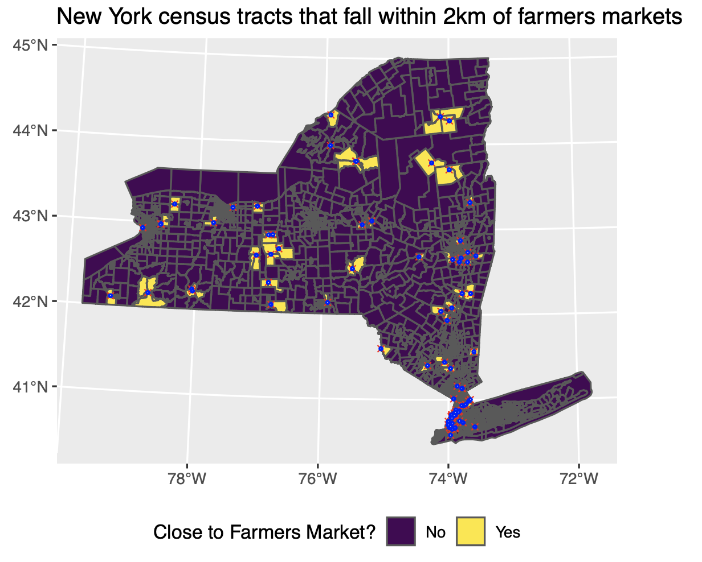
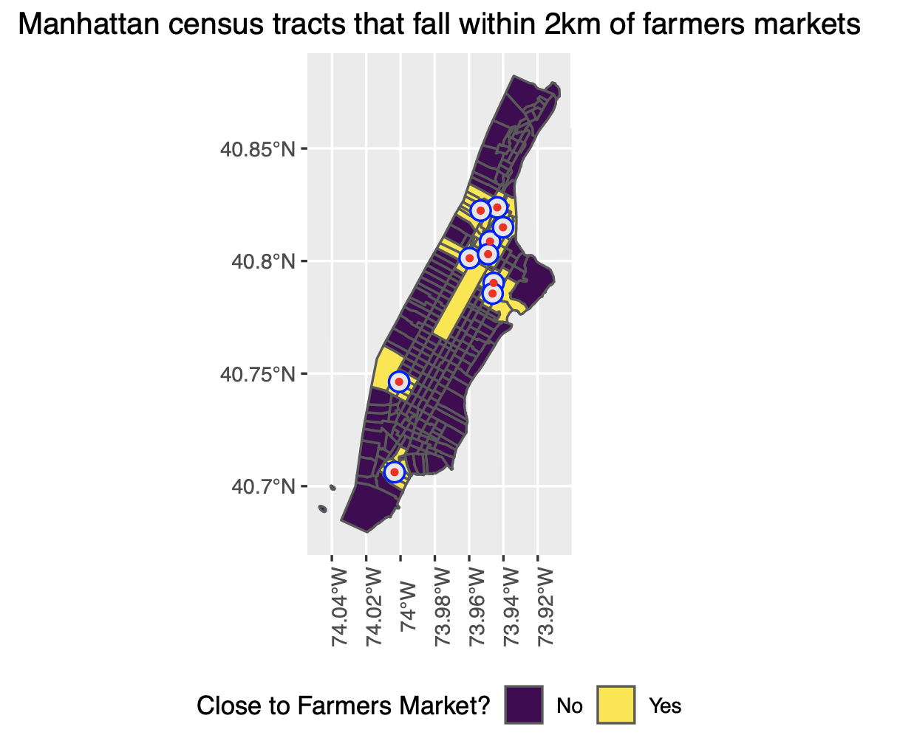

<!-- README.md is generated from README.Rmd. Please edit that file -->

```{r, include = FALSE}
knitr::opts_chunk$set(
  collapse = TRUE,
  comment = "#>"
)
```

# Geospatial Analysis in R

<!-- badges: start -->
<!-- badges: end -->

The repository is a collection of help documents I created for [NYU Data Services](https://guides.nyu.edu/dataservices) about various topics for geospatial analysis in R. The active link to the files serving on the Data Services can be found [here](https://guides.nyu.edu/c.php?g=276822&p=8242247). 

### GIS in R: Geocoding
Geocoding in R allows you to convert tabular datasets that contain geographic information to be mapped and analyzed within GIS software. The example used in this document is to convert a dataset of Black Lives Matter protests with longitude and latitude to a spatial object and then save it as a shapefile.

### GIS in R: Spatial Join
Spatial join allows you to combine information from different shapefiles by using spatial relationships as the join key. The example used in this document is to study how many counties in each state in which a large proportion of Black or African American live in poverty using two shapefiles, a U.S. states shapefile without the attribute of poverty and another shapefile of poverty rate by race at county-level. 

### GIS in R: Table Join
Joining Tabular data to a shapefile allows you to add fields from your data table to a shapefile’s attribute table based on matching values found in the key columns, so that you may generate a choropleth map of your variable of interest. The example used in this document is to study in which states do African Americans have high rates of uninsurance using two files, a U.S. states shapefile without the attribute of health insurance and a tabular file including the insurance data at state-level downloaded from U.S. Census.

### GIS in R: Clipping Shapefile
Clipping shapefile allows you to select certain features and attributes from a layer based on spatial extraction. The example used in this document is to study are there enough subway entrances and are they equally distributed and where can/should a new subway entrance be built by creating a shapefile of subway entrances restricted to the Manhattan borough boundary from a map of subway entrances throughout New York City.

### GIS in R: Merging Shapefile
Merging shapefile allows you to combine shapefiles from different sources or different time periods into a single shapefile for analysis. The example used in this document is to study stops and frisks by New York city police for the reason of burglary over time in New York city by combining shapefiles of stop, question and frisk due to burglary by NYPD from 2017 to 2019.

### GIS in R: Buffering
Buffering allows you to identify or define an area within a specified distance around a feature in order for spatial analysis or to indicate proximity or accessibility conditions. As many research have found that having limited or uncertain capacity for acquiring sufficient, safe, and nutritious food to meet dietary needs, known as food insecurity, can result in serious consequences such as increased risks of some birth defects, anemia, cognitive problems, aggression and anxiety, etc., The example used in this document is to study how many women in New York state live within 20 minutes walking distance to fresh food sources, specifically farmers markets, using two shapefiles, a New York state census tract shapefile with an attribute of women population and another shapefile of locations of all the farmers markets in New York state.





