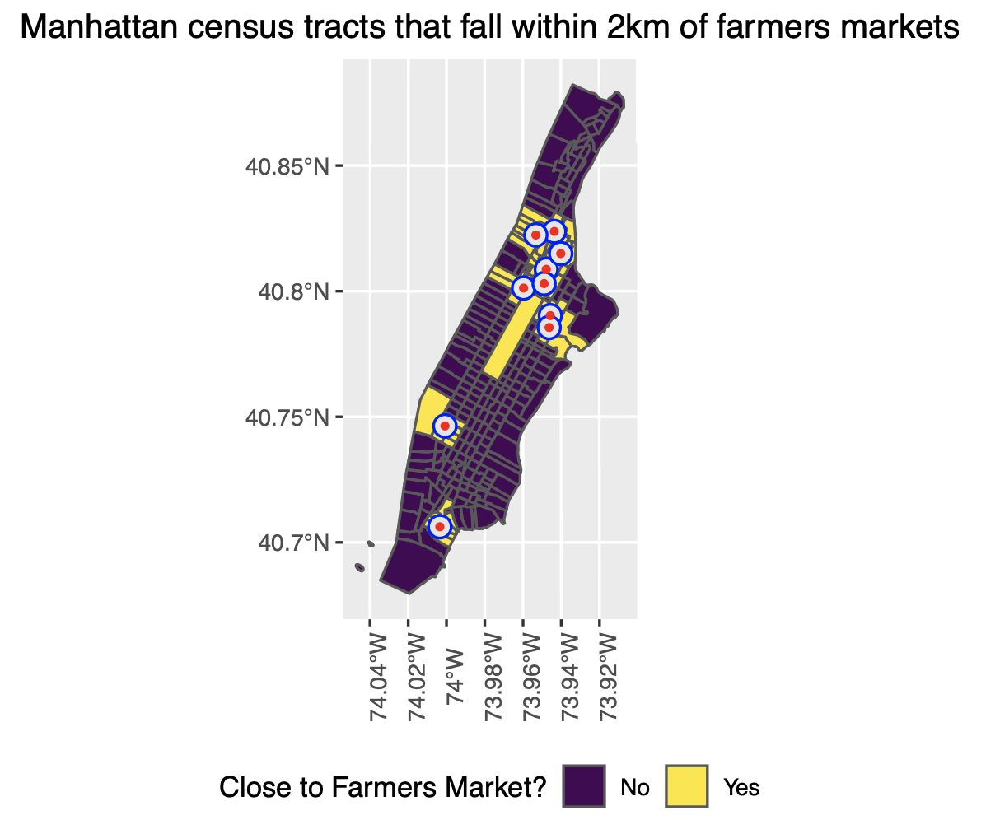

<!-- README.md is generated from README.Rmd. Please edit that file -->

# Geospatial Analysis in R

<!-- badges: start -->
<!-- badges: end -->

The repository is a collection of instructional documents I created for
[NYU Data Services](https://guides.nyu.edu/dataservices) about various
topics for geospatial analysis in R using ‘sf’ package. The active link
to the files serving on the Data Services website can be found
[here](https://guides.nyu.edu/gis/r).

### GIS in R: Geocoding

Geocoding in R allows you to convert tabular datasets that contain
geographic information to be mapped and analyzed within GIS software.
The example used in this document is to convert a dataset of Black Lives
Matter protests with longitude and latitude to a spatial object and then
save it as a shapefile.

### GIS in R: Spatial Join

Spatial join allows you to combine information from different shapefiles
by using spatial relationships as the join key. The example used in this
document is to study how many counties in each state in which a large
proportion of Black or African American live in poverty using two
shapefiles, a U.S. states shapefile without the attribute of poverty and
another shapefile of poverty rate by race at county-level.

### GIS in R: Table Join

Joining Tabular data to a shapefile allows you to add fields from your
data table to a shapefile’s attribute table based on matching values
found in the key columns, so that you may generate a choropleth map of
your variable of interest. The example used in this document is to study
in which states do African Americans have high rates of uninsurance
using two files, a U.S. states shapefile without the attribute of health
insurance and a tabular file including the insurance data at state-level
downloaded from U.S. Census.

### GIS in R: Clipping Shapefile

Clipping shapefile allows you to select certain features and attributes
from a layer based on spatial extraction. The example used in this
document is to study are there enough subway entrances and are they
equally distributed and where can/should a new subway entrance be built
by creating a shapefile of subway entrances restricted to the Manhattan
borough boundary from a map of subway entrances throughout New York
City.

### GIS in R: Merging Shapefile

Merging shapefile allows you to combine shapefiles from different
sources or different time periods into a single shapefile for analysis.
The example used in this document is to study stops and frisks by New
York city police for the reason of burglary over time in New York city
by combining shapefiles of stop, question and frisk due to burglary by
NYPD from 2017 to 2019.

### GIS in R: Buffering

Buffering allows you to identify or define an area within a specified
distance around a feature in order for spatial analysis or to indicate
proximity or accessibility conditions. As many research have found that
having limited or uncertain capacity for acquiring sufficient, safe, and
nutritious food to meet dietary needs, known as food insecurity, can
result in serious consequences such as increased risks of some birth
defects, anemia, cognitive problems, aggression and anxiety, etc., The
example used in this document is to study how many women in New York
state live within 20 minutes walking distance to fresh food sources,
specifically farmers markets, using two shapefiles, a New York state
census tract shapefile with an attribute of women population and another
shapefile of locations of all the farmers markets in New York state.

 
